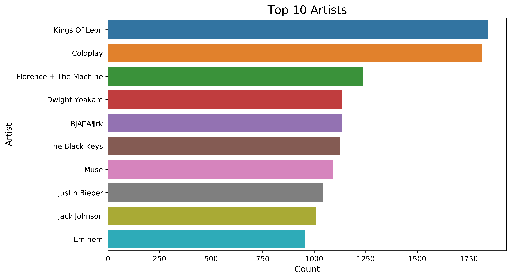
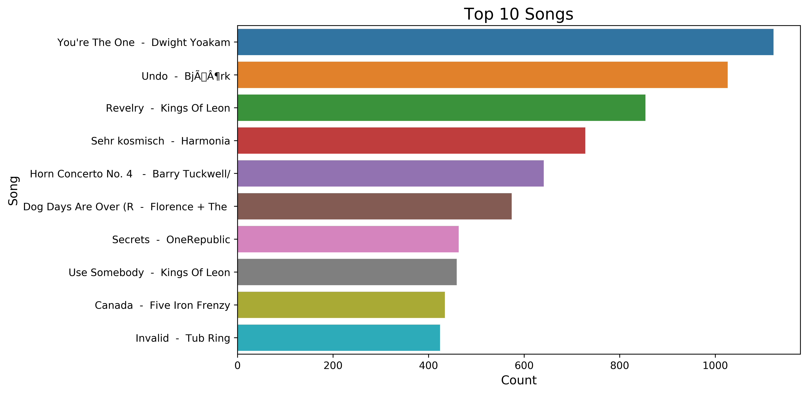
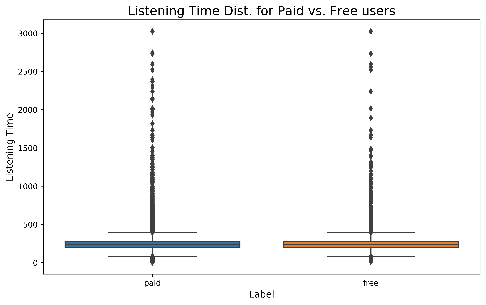
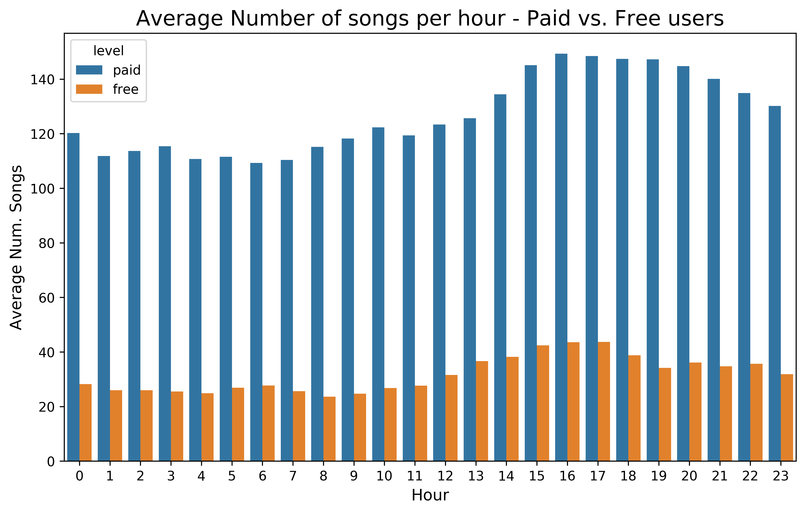
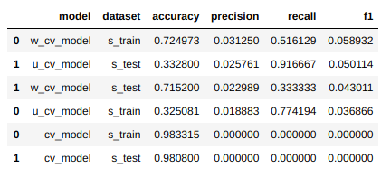

## Sparkify Churn Prediction

### Table of Contents

1. [Motivation](#motivation)
2. [Repository Structure / Files](#files)
3. [Exploratory Data Analysis](#eda)
4. [Feature Engineering](#feat_engineering)
5. [Model Training and Evaluation](#model_training)
6. [Licensing, Authors, and Acknowledgements](#licensing)

## Motivation

As part of the activities of Udacity's Data Science Nanodegree I'm enrolled, I developed this project, which aims at developing a Customer Churn Predictor using logs data from a fake Music streaming service named Sparkify - any resemblance to reality is purely coincidental XD 

The idea of the project is to train a prediction ML model to anticipate the churning of users from the system, where churning can be defined as either downgrading from paid to free service tier or cancelling the service altogether. As client churning leads to a decrease in a company's revenue, it is very important to be able to predict when users are likely to churn in order to try avoiding it by offering them discounts or bonuses.

A special characteristic of this project is that it deals with Big Data - the full dataset of the Streaming Service logs is around 12GB. Therefore, it creates a challenge which has to be dealt with using Big Data technologies/frameworks. In this case, I used the Python implementation of Apache Spark. The project analysis was conducted in two steps:
 - An analysis on a small subset of Sparkify's logs (~130MB) - conducted on Udacity's website embedded workspace
 - An analysis on the full dataset - conducted using AWS's EMR and S3 services.

## Repository Structure / Files 

The `assets` folder comprises:
  * Figures used in the medium post
  * Images of plots generated by (descriptive and predictive) analysis

The `data` folder comprises:
  * The small dataset in compressed format
  * The model-ready preprocessed dataset in Spark format (split into 200 parts)
  
The `drafts` folder comprises:
  * Draft notebooks of the unfinished analysis which ran on Amazon AWS clusters on both the small and big data sets.
  
In the root folder, it is possible to find a jupyter notebooks, namely Sparkify.ipynb, which contains the code, results and discussion of the whole analysis performed on the small subset of the Sparkify data. This analysis ran on Udacity's workspace.

## Exploratory Data Analysis

As with every piece of data which is to be analyzed, it is imperative to perform some exploration on it, aiming to understand its essence and get insights for the analysis. Here, I present some exploratory questions I've answered with the data:

- Who are the top-10 Artists overall?

  

- Which are the top-10 songs overall?

  

- How is the distribution of listening time for paid versus free users?

  

- How is the distribution of the average number of songs listened along the hours of the day for paid versus free versus all users?

  

## Feature Engineering

### Churning Definition

As suggested by the project description, churning can be defined/identified by either of two events:
- Cancellation: can happen for both paid and free users - when they access the Cancellation Confirmation page in the application
- Downgrading: when a paid user accesses the Submit Downgrading webpage and changes their level from paid to free afterwards

### Temporal Perspective

The temporal perspective should ALWAYS be considered when doing Data Science. However, in some contexts like the one of this project, it plays a fundamental role.
Here we have to answer two key question which will directly impact our analysis:

1 - When and How often do we want to predict churning?

In the case of this experiment, given the context, I chose to run the prediction at the beginning of every day for all users, and be able to act on a day range

2 - How early do we want ot be able to predict churning?

For the Sparkify project, I chose to use a 7-day anticipation window, to have one week to take actions in order to convince the user not to leave.

### Features

First of all, let us define that a row of our train / test / validation dataset is identified by user and a day.

In order to develop the classification model, I invested some time brainstorming and computing features from the log data:
I chose a few basic data-ready features: region and gender. 
I also computed a few temporal features: 
- median listening time
- number of accesses to cancel/download page
- number of accesses to thumbs up minus accesses to thumbs down
- number of logins minus logouts.

Each of the above temporal features was computed using a sliding window for a few time range periods: the previous 1, 3, 7, and 14 days before the prediction date.
The response variable was computed, as defined earlier, as, for a given user and day, whether or not the user will churn in the next 7 days.

## Model Training and Evaluation

### Handling Class Imbalance

The dataset is highly imbalanced as the number of churning user-day combinations found in the data represents only a small proportion (~1.7%) of the whole dataset. Thus, we need to be mindful of that when splitting our dataset into train / test / validation sets to have a similar representation of both classes in all sets, and in the model evaluation to stop the model from learning to just predict the major class for all cases as the error will be low.

In order to correctly split data, I applied a stratified split to keep the same class proportion in the subsets as in the original dataset.

Dealing with imbalanced datasets in the model evaluation is a bit more complex, and there are a number of techniques available. I tested some, namely: Undersampling and Class Weights.

I applied both techniques, fitted models for them and evaluated their results, which are described in the next sessions. For the evaluation, as suggested in the project description, I used F-1 measure to balance between precision and recall due to class imbalance.

### Model Selection and Hyperparameter Tuning

I chose to fit a few models, namely: Logistic Regression, Random Forest and Support Vector Classifiers. In order to run the model selection and hyperparameter tuning, I've used Spark pipelines with K-Fold Cross Validation using a Binary Classification Evaluator with the areaUnderPR (area under Precision-Recall curve) metric, which is a good metric for imbalanced datasets, as is the case.
 
### Results

For each model-hyperparameter combination, I computed the accuracy, precision, recall and f-1 score on both the train and test set. 

The table below describes the overall result (notice: u_cv - undersampled cross-validated model, w_cv - class weights cross-validated model, cv_model - naive original cross-validated model):

  

We can see in the above table that the overall top-performing model based on the f-1 score is the Class Weights model. Its performance on the train set achieves the highest f-1 score.

However, if we consider only the result on the test set, we will notice the undersampled data model is superior. Not only that but if we also consider the recall metric we will see that this model beats all others, as it is able to target the majority of soon-to-churn users.

Looking more carefully, if we consider the context of the problem which we are aiming to solve, the undersampled data model might not be performing so bad. It correctly targets most of the churning users at the expense of incorrectly targetting a lot of non-churning users as churning.

### Conclusions

1 - The dataset is highly imbalanced, as expected, and so it was a good opportunity to learn and exploit techniques to deal with this sort of problem, which is so common in real settings
2 - The temporal perspective is very key for a good understanding of this problem as well as a good solution design and implementation, and thus it was very beneficial for me as a Data Scientist to be challenged to think more carefully using this mindset.
3 - The final f-1 score is low for the best model, but we need to consider the problem context and its singularities. Only the business team can draw the line on how much they are willing to spend to keep their users from churning. 
4 - Maybe this problem could even be split into two: 1) predict whether a paid user will downgrade, and 2) predict whether a free user will cancel the service; and the company could choose to treat those two cases differently (with different actions as well as risk taking thresholds).

A more detailed description of the project, its analyses and insights can be found in the Medium post available [here]().

### Dependencies

The project only needs PySpark installed and the default libraries which come with Anaconda 3 package.

## Licensing, Authors, Acknowledgements

In order to achieve the results presented in this project, I've read many articles, tutorials and documentation from specialists/enthusiasts in the field of Distributed Processing, more specifically Spark, as well as in the subject of Imbalance Dataset handling to get insights on how to deal with the problems I've faced while analyzing the data. Below, I cite some of them:

- [Using Spark's ML library for Machine Learning](https://github.com/dsharpc/dsharpc.github.io/blob/master/SparkMLFlights/README.md)
- [Class Imbalance in Credit Card Fraud Detection - Part 3 : Undersampling in Spark](http://blog.madhukaraphatak.com/class-imbalance-part-3/)
- [Oversampling and Undersampling with PySpark | by Jun Wan](https://medium.com/@junwan01/oversampling-and-undersampling-with-pyspark-5dbc25cdf253)
- [Balancing Model Weights in PySpark](https://danvatterott.com/blog/2019/11/18/balancing-model-weights-in-pyspark/)
- [Spark ML Documentation](https://spark.apache.org/docs/2.4.3/api/python/pyspark.ml.html#)

Feel free to use the code provided that you give credits / cite this repo, as well as to contribute.
